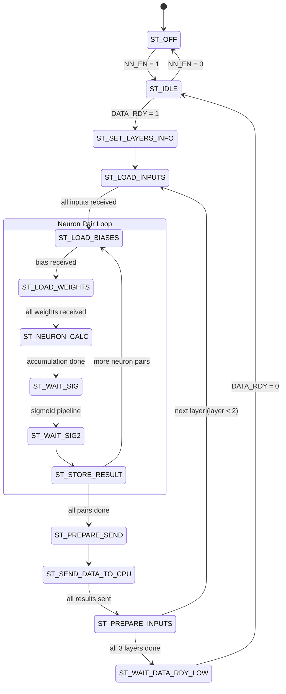

# Detailed System Specification: RISC-V-Based AI Accelerator System

## 1. System Overview

The RISC-V-based AI Accelerator system is a custom hardware/software co-design project targeting a **Xilinx Zynq UltraScale+ MPSoC (Ultra96v2)**. Based on a [reference Deep Neural Network Hardware Accelerator](https://github.com/StefanSredojevic/Deep-Neural-Network-Hardware-Accelerator), this implementation introduces a significant architectural shift: instead of relying on the Zynq Processing System (PS) to act as the primary host controller during inference, a soft-core **PicoRV32** RISC-V processor is instantiated in the Programmable Logic (PL) to take over the host responsibilities.

The primary application of this system is to perform inference on the MNIST handwritten digit dataset using a Multi-Layer Perceptron (MLP) accelerator, utilizing 16-bit fixed-point arithmetic (Q1.4.11 format).

## 2. System Architecture & Components

### 2.1 Block Diagram

```text
┌─────────────────────────────────── Programmable Logic (PL) ─────────────────────────────────────┐
│                                                                                                 │
│  ┌──────────┐                     ┌──────────────────────────────────┐                          │
│  │ Zynq PS  │─── M_HPM0_FPD ────►│                                  │                          │
│  └──────────┘                     │                                  │── M00 ──► PS HP0 (DDR4)  │
│  ┌──────────┐                     │                                  │                          │
│  │ PicoRV32 │─── M_AXI ─────────►│       AXI SmartConnect           │── M01 ──► MLP Accel      │
│  └──────────┘                     │       (Crossbar Interconnect)    │                          │
│  ┌──────────┐                     │                                  │── M04 ──► AXI DMA        │
│  │ AXI DMA  │─── M_AXI_MM2S ────►│  Decodes Addresses and routes    │                          │
│  │          │─── M_AXI_S2MM ────►│  to corresponding Slave          │── M05 ──► SW Reset       │
│  └─────────┬┘                     │                                  │                          │
│            │                      │                                  │── M02 ──► Shared Boot RAM│
│            ▼                      └──────────────────────────────────┘           (PS access)    │
│      (AXI-Stream)                                                                               │
│            │                                                                         ▲          │
│            ▼                                                                         │          │
│  ┌─────────┴────────────────────┐         ┌─────────────────────────┐                │          │
│  │      MLP Accelerator         │         │   64KB True Dual Port   │                │          │
│  │  (Datapath, Control, LUTs)   │         │       Block RAM         │◄── M03 ────────┘          │
│  └──────────────────────────────┘         └─────────────────────────┘    (Pico access)          │
│                                                                                                 │
└─────────────────────────────────────────────────────────────────────────────────────────────────┘
```

### 2.2 Zynq Processing System (PS)

*   **Role**: System Initializer & Bootloader
*   **Responsibilities**:
    *   Initializes the DDR4 memory controller so it can be accessed by the Programmable Logic (PL).
    *   Loads the C firmware for the PicoRV32 processor into a shared block RAM (BRAM).
    *   Pre-loads testing data (MNIST images, pre-trained weights, and biases in Q1.4.11 packed format) into the DDR memory.
    *   Writes to the SW Reset IP to release the PicoRV32 from reset.
    *   Once setup is complete, the PS takes a back seat, allowing the PicoRV32 to orchestrate the inference workload.

### 2.3 PicoRV32 (Host Controller)

*   **Role**: Main System Controller (in PL)
*   **Responsibilities**:
    *   Executes firmware from the shared BRAM (boot address `0x0000_0000`).
    *   Configures the MLP accelerator's network dimensions via AXI-Lite registers.
    *   Orchestrates inference by programming multiple AXI DMA transfers per layer: inputs, biases (per neuron pair), and weights (per neuron pair).
    *   Monitors DMA completion (polling S2MM Idle bit) to synchronize between layers.
    *   Reads final classification results from DDR after inference completes.

### 2.4 MLP Neural Network Accelerator (`accelerator_1_0`)

*   **Role**: Custom Hardware Inference Engine
*   **Hardware Interfaces**:
    *   **AXI-Lite Slave (`S00_AXI`)**: Used by PicoRV32 to configure the number of nodes per layer (`slv_reg0`–`slv_reg2`), control inference (`slv_reg3`), and read busy status (`slv_reg4`).
    *   **AXI-Stream Slave (`S00_AXIS`)**: High-speed streaming interface that receives data pushed by the DMA (inputs, biases, and weights — sequentially, per neuron pair).
    *   **AXI-Stream Master (`M00_AXIS`)**: High-speed streaming interface that outputs computed layer results back to the DMA.
*   **Internal Microarchitecture**:

    ```text
    S00_AXIS ──► [AXI-Stream Slave] ──► ┌────────────────┐
                                        │  Control Unit   │ ◄── [AXI-Lite Slave] ◄── PicoRV32
                                        │  (FSM)          │ ──► [AXI-Lite: BSY status]
                                        └───────┬────────┘
                                                │ BRAM addresses, enables, neuron control
                                                ▼
                                        ┌────────────────────────────────────────┐
                                        │            Data Path                   │
                                        │  ┌──────────┐ ┌──────────┐ ┌────────┐ │
                                        │  │Input BRAM│ │Bias BRAM │ │Wt BRAM │ │
                                        │  │ (16-bit) │ │ (16-bit) │ │(16-bit)│ │
                                        │  │DP, 2K×16 │ │DP, 2K×16 │ │DP,2K×16│ │
                                        │  └────┬─────┘ └────┬─────┘ └───┬────┘ │
                                        │       │PortA/B     │PortA/B    │PortA/B│
                                        │       ▼            ▼           ▼       │
                                        │  ┌──────────┐  ┌──────────┐            │
                                        │  │ Neuron A  │  │ Neuron B  │  ← 2 neurons parallel
                                        │  │ (MAC+Sat) │  │ (MAC+Sat) │            │
                                        │  └────┬──────┘  └────┬──────┘            │
                                        │       │ 10-bit addr  │ 10-bit addr       │
                                        │       ▼              ▼                   │
                                        │  ┌─────────────────────────┐             │
                                        │  │   Sigmoid Lookup ROM    │             │
                                        │  │   (1024 entries, 10-bit)│             │
                                        │  └────────┬────────────────┘             │
                                        │           │ 10-bit sigmoid output        │
                                        │           ▼                              │
                                        │  ┌──────────────┐                       │
                                        │  │ Output BRAM   │ (Results register)    │
                                        │  │DP, 2K×16      │                       │
                                        │  └───────┬───────┘                       │
                                        └──────────┼───────────────────────────────┘
                                                   │ 32-bit packed [resultB | resultA]
                                                   ▼
                                        [AXI-Stream Master] ──► M00_AXIS
    ```

*   **Dual-Neuron Parallelism**: Two neurons are computed simultaneously using the dual-port nature of the BRAMs. Port A serves Neuron A, Port B serves Neuron B. Each AXI-Stream word (32-bit) carries two 16-bit values packed as `[value_portB | value_portA]`.

### 2.5 AXI Direct Memory Access (DMA)

*   **Role**: High-Speed Data Mover
*   **IP**: Xilinx `axi_dma` (v7.1)
*   **Responsibilities**: Acts as a bridge between the Zynq PS HP0 port (DDR4 memory) and the MLP Accelerator.
    *   **MM2S (Memory-Mapped to Stream)**: Reads data from DDR (inputs, biases, weights) and streams it into the accelerator's `S00_AXIS` port. Firmware triggers **multiple separate MM2S transfers** per layer.
    *   **S2MM (Stream to Memory-Mapped)**: Receives computed layer results from the accelerator's `M00_AXIS` port and writes them back to a designated DDR buffer.

### 2.6 Interconnect and Utilities

*   **SmartConnect / AXI Crossbar**: Routes AXI memory-mapped transactions from the PicoRV32, Zynq PS, and DMA to the various peripherals based on address decoding.
*   **Software Reset IP (`sw_reset_1_0`)**: Provides a software-controlled active-low reset signal (`po_sw_rstn`) connected to the PicoRV32. The Zynq PS writes to this register to release the PicoRV32 from reset after loading firmware.

## 3. Neural Network Architecture

| Parameter | Value |
|---|---|
| **Type** | Multi-Layer Perceptron (MLP) |
| **Application** | MNIST handwritten digit recognition |
| **Topology** | 784 → 16 → 16 → 10 |
| **Activation** | Sigmoid (lookup table, 1024 entries, 10-bit output) |
| **Arithmetic** | Fixed-point Q1.4.11 (16-bit) |
| **Parallelism** | 2 neurons computed simultaneously (dual-port BRAMs) |

### 3.1 Fixed-Point Format (Q1.4.11)

```
Bit:  15  14 13 12 11  10 9 8 7 6 5 4 3 2 1 0
      S   I3 I2 I1 I0  F10 . . . . . . . . . F0

S:    Sign bit (1 = negative, two's complement)
I3-0: Integer part (4 bits, range: -16 to +15)
F10-0: Fractional part (11 bits, resolution: 1/2048 ≈ 0.000488)
```

### 3.2 Neuron Computation Pipeline

For each neuron pair, the hardware performs:

1.  **Multiply-Accumulate (MAC)**: `acc += input[i] × weight[i]` (Q1.4.11 × Q1.4.11 = Q2.8.22 accumulator)
2.  **Bias Addition**: Accumulator reduced to Q1.8.7, bias converted from Q1.4.11 to Q1.8.7, then summed.
3.  **Saturation**: Result clamped to Q1.4.5 range (10-bit address for sigmoid LUT).
4.  **Sigmoid Lookup**: 10-bit address → 10-bit sigmoid output (Q1.9 format, [0.0, 1.0]).
5.  **Output Mapping**: Sigmoid output extended to Q1.4.11 format: `{4'b0000, sig[9:0], 2'b00}`.

### 3.3 Accelerator FSM States



> **Note**: The FSM automatically iterates through all 3 computational layers (hidden1, hidden2, output). It stalls at each `ST_LOAD_*` state waiting for `pi_mlp_data_valid`, which allows the firmware to control data delivery via DMA at its own pace.

## 4. Register Map

*(Refer to `fpga/register_map.md` for specific bit-level descriptions.)*

### 4.1 MLP Accelerator AXI-Lite Registers (Base: `0x4000_0000`)

| Offset | Name | R/W | Description |
|---|---|---|---|
| `0x00` | `slv_reg0` | R/W | Input layer node count (e.g., 784) |
| `0x04` | `slv_reg1` | R/W | Hidden layer nodes, packed as two 16-bit fields: `[H2 | H1]`. H1 = bits [15:0], H2 = bits [31:16] |
| `0x08` | `slv_reg2` | R/W | Output layer node count (e.g., 10) |
| `0x0C` | `slv_reg3` | R/W | Control: bit[0] = `NN_EN`, bit[1] = `DATA_RDY` |
| `0x10` | `slv_reg4` | R | Status: bit[0] = `BSY` (1 = computation in progress) |

> **`slv_reg1` packing**: For the network 784 → 16 → 16 → 10, the value written is `(16 << 16) | 16 = 0x0010_0010`. The control unit extracts `current_layer[0] = slv_reg1[15:0]`, `current_layer[1] = slv_reg1[31:16]`.

### 4.2 AXI DMA Registers (Base: `0x4001_0000`)

| Offset | Name | R/W | Description |
|---|---|---|---|
| `0x00` | `MM2S_DMACR` | R/W | Control: bit[0]=RS (Run/Stop) |
| `0x04` | `MM2S_DMASR` | R/W1C | Status: bit[0]=Halted, bit[1]=Idle |
| `0x18` | `MM2S_SA` | R/W | Source address in DDR (lower 32-bit) |
| `0x28` | `MM2S_LENGTH` | R/W | Transfer length in bytes (**writing starts transfer**) |
| `0x30` | `S2MM_DMACR` | R/W | Control: bit[0]=RS (Run/Stop) |
| `0x34` | `S2MM_DMASR` | R/W1C | Status: bit[0]=Halted, bit[1]=Idle |
| `0x48` | `S2MM_DA` | R/W | Destination address in DDR (lower 32-bit) |
| `0x58` | `S2MM_LENGTH` | R/W | Transfer length in bytes (**writing starts transfer**) |

### 4.3 SW Reset IP Register (Base: `0xA003_0000`, PS-only)

| Offset | Name | R/W | Description |
|---|---|---|---|
| `0x00` | `SW_RESET` | R/W | bit[0]: 0 = hold PicoRV32 in reset, 1 = release |

## 5. System Memory Map

| Address Range (Pico) | Address Range (Zynq PS) | Size | Component | Description |
|---|---|---|---|---|
| `0x0000_0000` – `0x0000_FFFF` | `0xA000_0000` – `0xA000_FFFF` | 64KB | Shared Boot BRAM | PicoRV32 firmware & stack |
| `0x1000_0000` – `0x1FFF_FFFF` | `0x1000_0000` – `0x1FFF_FFFF` | 256MB | DDR4 (via PS HP0) | Weights, inputs, results |
| `0x4000_0000` – `0x4000_FFFF` | N/A | 64KB | MLP AXI-Lite | Accelerator control/status |
| `0x4001_0000` – `0x4001_FFFF` | N/A | 64KB | AXI DMA | DMA control/status registers |
| N/A | `0xA003_0000` – `0xA003_FFFF` | 64KB | SW Reset | Software reset controller |

## 6. DDR Data Layout

The Zynq PS pre-loads all inference data into DDR before releasing the PicoRV32. Data is stored in Q1.4.11 fixed-point, packed as two 16-bit values per 32-bit word: `[value_portB | value_portA]`.

```
DDR Address        Content                              Size
──────────────────────────────────────────────────────────────────
0x1000_0000        MNIST Image (784 pixels)              392 words
                   Packed: [pixel1 | pixel0] per word
                   
0x1000_1000        Biases for all layers (sequential)
                    ├─ Layer 0: 8 words  (16 biases)
                    ├─ Layer 1: 8 words  (16 biases)
                    └─ Layer 2: 5 words  (10 biases)
                   
0x1000_2000        Weights for all layers (sequential)
                    ├─ Layer 0: 8 groups × 784 words     = 6272 words
                    │   └─ Each group = weights for 1 neuron pair
                    │      [w_neuronB[i] | w_neuronA[i]] × prev_size
                    ├─ Layer 1: 8 groups × 16 words      = 128 words
                    └─ Layer 2: 5 groups × 16 words      = 80 words
                   
0x1010_0000        Hidden Layer 1 output buffer           8 words
0x1010_0100        Hidden Layer 2 output buffer           8 words
0x1010_0200        Final output buffer (10 scores)        5 words
```

### 6.1 Weight Ordering per Neuron Pair

For each neuron pair iteration, the DMA streams `previous_layer_size` words. Each word contains two weights:

```
Word[i] = { weight_neuronB[i], weight_neuronA[i] }     (i = 0..prev_size-1)
```

Where `neuronA = pair_index × 2` and `neuronB = pair_index × 2 + 1`.

## 7. Execution Flow (Inference Phase)

### 7.1 System Boot Sequence

1.  **PS Boot**: The Zynq PS powers up and initializes the DDR4 memory controller.
2.  **Firmware Loading**: PS writes PicoRV32 firmware into the shared BRAM via address `0xA000_0000`.
3.  **Data Loading**: PS writes MNIST image data, pre-trained weights, and biases into DDR at the addresses defined in §6.
4.  **PicoRV32 Release**: PS writes `1` to SW Reset register (`0xA003_0000`) → PicoRV32 begins execution from `0x0000_0000`.

### 7.2 Inference Flow (per image)

The PicoRV32 firmware orchestrates inference as follows:

```
Step 1: Configure Accelerator
        Write slv_reg0 = 784      (input nodes)
        Write slv_reg1 = 0x00100010  (hidden: [16 | 16])
        Write slv_reg2 = 10       (output nodes)
        Write slv_reg3 = 0x3      (NN_EN=1, DATA_RDY=1)
        → FSM transitions: ST_OFF → ST_IDLE → ST_SET_LAYERS_INFO → ST_LOAD_INPUTS

Step 2: Process Layer 0  (784 → 16)
Step 3: Process Layer 1  (16  → 16)
Step 4: Process Layer 2  (16  → 10)

Step 5: Clear DATA_RDY
        Write slv_reg3 = 0x1      (NN_EN=1, DATA_RDY=0)
        → FSM transitions: ST_WAIT_DATA_RDY_LOW → ST_IDLE

Step 6: Read results from DDR output buffer
```

### 7.3 Detailed Per-Layer Data Flow

Each layer follows this firmware ↔ hardware protocol:

```
Firmware (PicoRV32)                         Hardware (FSM)
───────────────────                         ──────────────
                                            ST_LOAD_INPUTS (stalling, waiting for data)
                                                │
DMA MM2S: prev_size/2 words ──stream──►         │ Receives inputs, writes to Input BRAM
                                                ▼
                                            ST_LOAD_BIASES (stalling)
                                                │
DMA MM2S: 1 word (2 biases) ──stream──►         │ Receives bias pair, writes to Bias BRAM
                                                ▼
                                            ST_LOAD_WEIGHTS (stalling)
                                                │
DMA MM2S: prev_size words ──stream──►           │ Receives weights, writes to Weight BRAM
                                                ▼
                                            ST_NEURON_CALC (auto, no DMA needed)
                                            │  MAC: acc += input[i] × weight[i]
                                            ▼
                                            ST_WAIT_SIG → ST_WAIT_SIG2 (sigmoid pipeline)
                                            ▼
                                            ST_STORE_RESULT → writes to Output BRAM
                                            │
                                            ├── More neuron pairs? → back to ST_LOAD_BIASES
                                            │   (Firmware sends next bias + weights via DMA)
                                            │
                                            └── All pairs done ▼
                                            
                                            ST_PREPARE_SEND → ST_SEND_DATA_TO_CPU
                                                │ Outputs curr_size/2 words via M00_AXIS
◄──stream── DMA S2MM receives results          │
            writes to DDR output buffer         ▼
                                            ST_PREPARE_INPUTS
Poll S2MM Idle = 1 ← layer done!               │
                                            ├── Layer < 2? → ST_LOAD_INPUTS (next layer)
Setup DMA for next layer ──────────────►    │   (FSM stalls, waiting for new data)
                                            └── Layer = 2 → ST_WAIT_DATA_RDY_LOW
```

### 7.4 DMA Transfer Summary per Layer

| Layer | Input Source | # MM2S Transfers | # S2MM Transfers | Data to accelerator |
|---|---|---|---|---|
| 0 (784→16) | DDR image | 1 (inputs) + 8×(1 bias + 1 weights) = **17** | **1** | 392 + 8×(1+784) = 6672 words |
| 1 (16→16) | DDR hidden1 | 1 + 8×(1+1) = **17** | **1** | 8 + 8×(1+16) = 144 words |
| 2 (16→10) | DDR hidden2 | 1 + 5×(1+1) = **11** | **1** | 8 + 5×(1+16) = 93 words |
| **Total** | | **45 MM2S** | **3 S2MM** | |

### 7.5 Layer Synchronization

The firmware uses **DMA S2MM completion** to synchronize between layers:

*   After setting up S2MM for a layer's output, firmware polls `S2MM_DMASR` bit[1] (Idle).
*   When Idle=1, the layer output is committed to DDR and can be used as input for the next layer.
*   The FSM is already stalling at `ST_LOAD_INPUTS` of the next layer, waiting for data.
*   Firmware programs new MM2S transfer → data flows → FSM resumes.

The `BSY` flag (slv_reg4 bit[0]) indicates overall accelerator activity:
*   `BSY=1`: FSM is actively processing (any state except `ST_OFF`, `ST_IDLE`, `ST_WAIT_DATA_RDY_LOW`).
*   `BSY=0`: Inference complete or idle.

## 8. Future Extensions

While the initial testing phase relies on pre-loaded MNIST data in DDR, the system architecture is designed to accommodate future extensions:
*   **Camera Integration**: Implementing a UART or custom interface to stream real-time image data from an external camera into DDR.
*   **LED Display**: Outputting the final inference result (0–9 digit) to onboard LEDs for immediate visual feedback.
