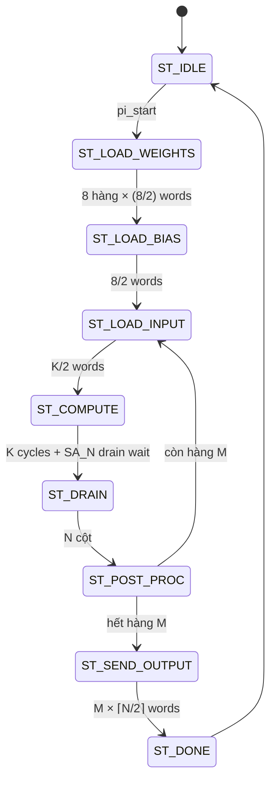

# Detailed System Specification — RISC-V Based AI Accelerator (RAAS)

> Target board: **Xilinx Zynq UltraScale+ MPSoC – Avnet Ultra96-v2**
> Toolchain: Vivado 2025.2.1, Vitis 2025.2.1, RISC-V GNU toolchain (`riscv32-xilinx-elf-gcc`)

## 1. System Overview

RAAS là một SoC hardware/software co-design trên Ultra96-v2, trong đó **toàn bộ luồng inference được điều khiển bởi một soft-core RISC-V (PicoRV32)** đặt trong Programmable Logic (PL). Zynq Processing System (PS) chỉ đóng vai trò *bootstrap*: khởi tạo DDR4, nạp firmware/dữ liệu rồi giải phóng PicoRV32. Sau đó PS đứng ngoài, PicoRV32 trở thành host CPU duy nhất trong vòng lặp inference.

Hệ thống sử dụng **một nhân tăng tốc duy nhất** — Systolic Array 8×8 weight-stationary (TPU-like GEMM engine) — để chạy inference LeNet-5 trên tập dữ liệu MNIST. Toàn bộ hệ thống dùng định dạng số học **fixed-point Q1.4.11 (16-bit signed)** và giao tiếp qua AXI-Lite/AXI-Stream.

## 2. System Architecture

### 2.1 Block Diagram

```text
┌─────────────────────────────── Programmable Logic (PL) ──────────────────────────────────┐
│                                                                                          │
│  ┌──────────┐                ┌────────────────────────┐                                  │
│  │ Zynq PS  │─ M_HPM0_FPD ──►│                        │── M00 ─► PS HP0 (DDR4)           │
│  └──────────┘                │                        │                                  │
│  ┌──────────┐                │                        │── M01 ─► Systolic Accelerator    │
│  │ PicoRV32 │─ M_AXI ───────►│   AXI SmartConnect     │                                  │
│  └──────────┘                │   (Crossbar)           │── M02 ─► Shared Boot BRAM        │
│  ┌──────────┐                │                        │         (Pico instr/data)        │
│  │ AXI DMA  │─ M_AXI_MM2S ──►│                        │── M04 ─► AXI DMA cfg             │
│  │          │─ M_AXI_S2MM ──►│                        │── M05 ─► SW Reset IP             │
│  └────┬─────┘                └────────────────────────┘                                  │
│       │ AXI-Stream                                                                       │
│       ▼                                                                                  │
│  ┌────────────────────────────┐      ┌──────────────────────────────┐                    │
│  │  Systolic Array Accelerator│      │   64KB Dual-Port Boot BRAM   │◄── M03 ── PicoRV32│
│  │  AXI-Lite + Stream slave/  │      │   (Pico boot + PS load)      │                    │
│  │  master, fixed-point engine│      └──────────────────────────────┘                    │
│  └────────────────────────────┘                                                          │
│                                                                                          │
└──────────────────────────────────────────────────────────────────────────────────────────┘
```

### 2.2 Zynq Processing System (PS) — *Bootstrap only*

Trách nhiệm trong toàn bộ vòng đời hệ thống chỉ giới hạn ở phase boot:
1. Khởi tạo DDR4 controller (PS DDR4 + HP0 cho PL truy cập).
2. Nạp firmware PicoRV32 (`.bin`) vào Shared Boot BRAM tại `0xA000_0000`.
3. Nạp dữ liệu inference (ảnh MNIST, trọng số, bias) vào DDR4.
4. Ghi `1` vào SW Reset IP (`0xA003_0000`) để giải phóng PicoRV32.
5. Sau đó chỉ poll mailbox trong DDR để biết kết quả.

### 2.3 PicoRV32 — *Host CPU trong PL*

- Soft-core RISC-V (RV32IM) với AXI master, boot tại `0x0000_0000` (Pico view) ↔ `0xA000_0000` (PS view) trên Shared BRAM.
- Là CPU **duy nhất** điều khiển inference loop. PS không tham gia tính toán.
- Trách nhiệm:
  - Cấu hình accelerator qua AXI-Lite (kích thước tile, control bits, activation mode).
  - Thực hiện im2col transform cho Conv layers, max-pool 2×2 bằng software.
  - Lập lịch tiled GEMM: vòng lặp tile (M,K,N ≤ 8) với K-accumulation bằng software.
  - Lập lịch các transfer AXI DMA: weights → bias → input → output.
  - Đồng bộ bằng polling: DMA `Idle` + accelerator `DONE`.
  - Cập nhật mailbox trong DDR để PS biết trạng thái.
- Firmware: [sw/picorv32/](../sw/picorv32/), build bằng `Makefile` trong cùng thư mục.
- **Lưu ý:** PicoRV32 không hỗ trợ lệnh `fence`. Dùng `nop` + compiler barrier thay thế (xem `io.h`).

### 2.4 Systolic Array Accelerator

[hw/accelerator_2_0/](../hw/accelerator_2_0/)

Systolic array 8×8 weight-stationary để thực hiện phép nhân ma trận (GEMM) tile `C[M×N] = A[M×K] × W[K×N] + bias[N]` với M, K, N ≤ 8. Firmware sử dụng im2col để map convolution → GEMM.

#### 2.4.1 Cấu trúc nội bộ

```text
S00_AXIS ─►[ AXIS Slave ]─► ┌──────────────────────────┐
                            │  Control Unit (FSM)      │◄─[ AXI-Lite ]◄── PicoRV32
                            │  IDLE → LOAD_WEIGHTS →   │─►[ AXI-Lite Status ]
                            │  LOAD_BIAS → LOAD_INPUT  │
                            │  → COMPUTE → DRAIN →     │
                            │  POST_PROC → SEND → DONE │
                            └──────┬───────────────────┘
                                   │ wload, w_data, a_row_data, a_row_valid
                                   ▼
                            ┌─────────────────────────────────────┐
                            │   Datapath: 8×8 PE Grid             │
                            │   Weight-Stationary,                │
                            │   psum vertical (top→bottom)        │
                            │   pe.sv: psum = psum_in + a × w_reg │
                            └──────┬──────────────────────────────┘
                                   │ 40-bit psum × 8 cột (Q2.8.22 sau K phép)
                                   ▼
                            ┌─────────────────────────────────────┐
                            │  Post-Processing                     │
                            │  S1: trunc Q2.8.22→Q1.8.7 + bias     │
                            │  S2: activation (bypass/ReLU/sigmoid)│
                            │  S3: saturate → Q1.4.11 (16-bit)     │
                            └──────┬──────────────────────────────┘
                                   ▼
                            [ AXIS Master ] ─► M00_AXIS (2×16-bit / word)
```

Module chính:

| File | Vai trò |
|---|---|
| [accelerator.v](../hw/accelerator_2_0/hdl/accelerator.v) | Top-level wrapper, AXI ports + module instantiations |
| [control_unit.sv](../hw/accelerator_2_0/hdl/control_unit.sv) | FSM 9 trạng thái, lập lịch toàn tile |
| [data_path.sv](../hw/accelerator_2_0/hdl/data_path.sv) | Lưới 8×8 PE, sinh `genvar`, psum chain dọc |
| [pe.sv](../hw/accelerator_2_0/hdl/pe.sv) | 1 PE: weight reg + multiply + psum HOLD logic |
| [post_proc.sv](../hw/accelerator_2_0/hdl/post_proc.sv) | Pipeline 3 stages: bias / activation / saturate |
| [sigmoid_lookup.sv](../hw/accelerator_2_0/hdl/sigmoid_lookup.sv) | Sigmoid LUT (1024 × 10-bit) |

#### 2.4.2 Đặc tính số học

- Activation/Weight/Bias: **Q1.4.11** (S | I3..I0 | F10..F0).
- Phép nhân trong PE: Q1.4.11 × Q1.4.11 = Q2.8.22 (32-bit), sign-extend lên 40-bit để tích lũy trong tối đa 8 phần tử K.
- Post-proc bias add ở Q1.8.7 (rút ngắn từ acc[39]&acc[29:15]); kết quả saturate trở lại Q1.4.11.

#### 2.4.3 FSM của Control Unit


```mermaid
stateDiagram-v2
    [*] --> ST_IDLE
    ST_IDLE --> ST_LOAD_WEIGHTS : pi_start
    ST_LOAD_WEIGHTS --> ST_LOAD_BIAS : 8 hàng × (8/2) words
    ST_LOAD_BIAS --> ST_LOAD_INPUT : 8/2 words
    ST_LOAD_INPUT --> ST_COMPUTE : K/2 words
    ST_COMPUTE --> ST_DRAIN : K cycles + SA_N drain wait
    ST_DRAIN --> ST_POST_PROC : N cột
    ST_POST_PROC --> ST_LOAD_INPUT : còn hàng M
    ST_POST_PROC --> ST_SEND_OUTPUT : hết hàng M
    ST_SEND_OUTPUT --> ST_DONE : M × ⌈N/2⌉ words
    ST_DONE --> ST_IDLE
```

Số word output = `M_tile × ⌈N_tile / 2⌉`.

### 2.5 AXI Direct Memory Access (DMA)

- IP: Xilinx `axi_dma` v7.1, một kênh MM2S + một kênh S2MM, **không** scatter-gather (Simple Mode).
- Bridge giữa Zynq PS HP0 (DDR4) và stream port của accelerator.
- Driver: PicoRV32 viết trực tiếp vào register map. Mỗi transfer = 1 mô tả: ghi `SA/DA` rồi ghi `LENGTH` để start, poll `Idle`/`ERR_MASK`.

### 2.6 SW Reset IP & SmartConnect

- `sw_reset_1_0`: register 1 bit ở `0xA003_0000` (PS-only). PS ghi `1` để release PicoRV32 khỏi reset.
- AXI SmartConnect: routing crossbar, chuyển đổi clock/width giữa các domain (PS @ 100 MHz, PL fabric @ 100 MHz).

## 3. Neural Network Architecture — LeNet-5

> **Lưu ý quan trọng:** Model thực tế (xem [model.py](../model/LeNet5-MNIST-PyTorch/model.py)) dùng **input 28×28** (MNIST gốc, không padding 32×32), và `FC1 = Linear(256, 120)` — tức `pool2_out = 4×4×16 = 256`.

| # | Layer | Config | Input Shape | Output Shape | Activation | Params |
|---|---|---|---|---|---|---|
| 1 | Conv1 | 1→6, 5×5, stride=1 | 28×28×1 | 24×24×6 | ReLU | 150 W + 6 B |
| 2 | Pool1 | MaxPool 2×2 | 24×24×6 | 12×12×6 | — | 0 |
| 3 | Conv2 | 6→16, 5×5, stride=1 | 12×12×6 | 8×8×16 | ReLU | 2400 W + 16 B |
| 4 | Pool2 | MaxPool 2×2 | 8×8×16 | 4×4×16 | — | 0 |
| 5 | FC1 | 256→120 | 256 | 120 | ReLU | 30720 W + 120 B |
| 6 | FC2 | 120→84 | 120 | 84 | ReLU | 10080 W + 84 B |
| 7 | FC3 | 84→10 | 84 | 10 | ReLU | 840 W + 10 B |

**Total parameters:** 44,426 (weights: 44,190 + bias: 236) = **88,852 bytes** (86.8 KB) ở Q1.4.11.

### 3.1 Mapping Conv→GEMM via im2col

Systolic array chỉ biết nhân ma trận. Convolution được map bằng **im2col**:

```
Conv(H_in, W_in, C_in, K=5, C_out)
  → im2col → A[M × K_total] × W[K_total × N] = C[M × N]

  M       = H_out × W_out          (số output pixels/patches)
  K_total = C_in × kH × kW         (số phần tử trong 1 receptive field)
  N       = C_out                   (số filters)
```

| Layer | GEMM shape (M×K×N) | Tiles (÷8) | Total tile ops |
|---|---|---|---|
| Conv1 | 576 × 25 × 6 | 72 × 4 × 1 | 288 |
| Conv2 | 64 × 150 × 16 | 8 × 19 × 2 | 304 |
| FC1 | 1 × 256 × 120 | 1 × 32 × 15 | 480 |
| FC2 | 1 × 120 × 84 | 1 × 15 × 11 | 165 |
| FC3 | 1 × 84 × 10 | 1 × 11 × 2 | 22 |
| **Total** | | | **1,259** |

Khi `K_total > 8`, firmware thực hiện **software K-accumulation**: chạy nhiều tile trên chiều K với accelerator ở chế độ bypass, firmware tự cộng dồn, rồi apply bias + activation bằng software ở tile K cuối cùng.

### 3.2 Định dạng Q1.4.11

```
Bit:  15 | 14 13 12 11 | 10 9 8 7 6 5 4 3 2 1 0
       S |   I3..I0    |       F10..F0
```
- Range: ≈ [−16.0, +15.99951…], step 2⁻¹¹.

## 4. Register Map

### 4.1 Accelerator (`0x4000_0000`)

| Offset | Tên | R/W | Mô tả |
|---|---|---|---|
| `0x00` | `TILE_M_SIZE` | R/W | Số hàng A trong tile (1..8) |
| `0x04` | `TILE_K_SIZE` | R/W | Số cột A / hàng B (1..8) |
| `0x08` | `TILE_N_SIZE` | R/W | Số cột B (1..8) |
| `0x0C` | `CONTROL` | R/W | bit0=`START`, bit2:1=`ACT_MODE` (00 bypass / 01 ReLU / 10 sigmoid) |
| `0x10` | `STATUS` | R | bit0=`BUSY`, bit1=`DONE` |

### 4.2 AXI DMA (`0x4001_0000`)

| Offset | Tên | Mô tả |
|---|---|---|
| `0x00` | `MM2S_DMACR` | bit0=RS, bit2=Reset |
| `0x04` | `MM2S_DMASR` | bit0=Halted, bit1=Idle, bit[10:4]=Errors |
| `0x18/0x1C` | `MM2S_SA / SA_MSB` | Source address (LSB / MSB) |
| `0x28` | `MM2S_LENGTH` | **Ghi để start MM2S** |
| `0x30/0x34` | `S2MM_DMACR / DMASR` | Tương tự cho kênh write-back |
| `0x48/0x4C` | `S2MM_DA / DA_MSB` | Destination address |
| `0x58` | `S2MM_LENGTH` | **Ghi để start S2MM** |

### 4.3 SW Reset (`0xA003_0000`, PS-only)

| Offset | Tên | Mô tả |
|---|---|---|
| `0x00` | `SW_RESET` | bit0: 0=hold, 1=release PicoRV32 |

## 5. Address Map

| Range (Pico view) | Range (PS view) | Size | Component |
|---|---|---|---|
| `0x0000_0000`–`0x0000_FFFF` | `0xA000_0000`–`0xA000_FFFF` | 64 KB | Shared Boot BRAM (firmware + stack) |
| `0x1000_0000`–`0x1FFF_FFFF` | `0x1000_0000`–`0x1FFF_FFFF` | 256 MB | DDR4 (PS HP0) — weights, image, feature maps, mailbox |
| `0x4000_0000`–`0x4000_FFFF` | — | 64 KB | Accelerator AXI-Lite |
| `0x4001_0000`–`0x4001_FFFF` | — | 64 KB | AXI DMA registers |
| — | `0xA003_0000`–`0xA003_FFFF` | 64 KB | SW Reset IP |

### 5.1 DDR Layout — LeNet-5

```
Base = 0x1000_0000 (cả PS view lẫn Pico view)

Offset        Size       Description
────────────  ─────────  ─────────────────────────────────────────
=== Weights & Bias (PS prefill, Pico đọc) ===
0x0000_0000     1568 B   IMAGE_INPUT   — 28×28×1 Q1.4.11 (784 elements)
0x0000_0800       12 B   CONV1_BIAS    — 6 elements
0x0000_0900      300 B   CONV1_WEIGHT  — 150 elements (6×1×5×5)
0x0000_0C00       32 B   CONV2_BIAS    — 16 elements
0x0000_0D00     4800 B   CONV2_WEIGHT  — 2400 elements (16×6×5×5)
0x0000_2000      240 B   FC1_BIAS      — 120 elements
0x0000_2100    61440 B   FC1_WEIGHT    — 30720 elements (120×256)
0x0001_2000      168 B   FC2_BIAS      — 84 elements
0x0001_2100    20160 B   FC2_WEIGHT    — 10080 elements (84×120)
0x0001_7000       20 B   FC3_BIAS      — 10 elements
0x0001_7100     1680 B   FC3_WEIGHT    — 840 elements (10×84)

=== Scratch / Feature Maps (Pico đọc/ghi) ===
0x0002_0000    28800 B   IM2COL_BUF    — im2col scratch (max = Conv1: 576×25×2B)
0x0002_8000     6912 B   FMAP_A        — ping buffer (max = conv1_out: 24×24×6×2B)
0x0003_0000     6912 B   FMAP_B        — pong buffer (double-buffering)
0x0003_8000      128 B   TILE_OUT_BUF  — DMA S2MM receive buffer (8×8 tile)
0x0003_8100      128 B   TILE_W_BUF   — tiled weight staging area
0x0003_8200       16 B   TILE_B_BUF   — tiled bias staging area
0x0003_8300      128 B   TILE_IN_BUF  — tiled input staging area

=== Communication ===
0x0004_0000        4 B   MAILBOX       — status word (magic values)
0x0004_0004        4 B   PREDICTED     — argmax result (predicted digit)
0x0004_0008        4 B   LAYER_DBG     — current layer index (debug)

────────────  ─────────
0x0005_0000           END (~320 KB used / 256 MB available)
```

### 5.2 Memory Fit Analysis

| Resource | Capacity | Used | Fit? |
|---|---|---|---|
| **BRAM** (firmware) | 64 KB | ~4 KB code + stack | ✅ ~6% used |
| **DDR** (data) | 256 MB | ~320 KB (weights 87KB + fmaps 60KB + scratch 29KB + tile bufs) | ✅ ~0.1% used |

- **Firmware estimate:** Smoke test = 932 B. LeNet thêm ~3 KB (gemm_tile + im2col + pool + lenet). Tổng ước tính ~4 KB code. Stack ~2 KB. Rất thoải mái trong 64 KB BRAM.
- **DDR estimate:** Weights+bias 87 KB + im2col scratch 28 KB + 2 feature map buffers 14 KB + tile staging 0.4 KB + image 1.5 KB ≈ 131 KB. Rất thoải mái trong 256 MB DDR.

## 6. Execution Flow

### 6.1 Boot

1. PS power-on → init DDR4 / clocks.
2. PS copy firmware Pico (`.bin` đã được `bin_to_c.py` chuyển sang C array trong `.h`) vào `0xA000_0000`.
3. PS load weights/bias/image vào DDR theo layout §5.1.
4. PS ghi `0xA003_0000` ← 1 → PicoRV32 chạy.
5. PS poll mailbox, đọc `predicted_digit` khi done.

### 6.2 LeNet-5 Inference (PicoRV32 firmware)

Mỗi tile GEMM:
```
Step 1  Pico copy tiled weight/bias/input từ DDR layout → tile staging buffers
Step 2  Pico ghi TILE_M/K/N, ghi CONTROL = START | ACT_MODE
Step 3  DMA MM2S streaming: weights (≤128B) → bias (≤16B) → input (≤128B)
Step 4  DMA S2MM nhận output (≤128B) vào TILE_OUT_BUF
Step 5  Pico poll DONE + S2MM Idle
Step 6  Nếu K > 8: cộng dồn output tile vào accumulator buffer (software)
```

Luồng đầy đủ cho 1 ảnh:
```
1. mailbox = STARTED
2. Conv1: im2col(image → IM2COL_BUF) → tiled GEMM(576×25×6, ReLU) → FMAP_A
3. Pool1: maxpool_2x2(FMAP_A → FMAP_B)         [software trên Pico]
4. Conv2: im2col(FMAP_B → IM2COL_BUF) → tiled GEMM(64×150×16, ReLU) → FMAP_A
5. Pool2: maxpool_2x2(FMAP_A → FMAP_B)         [software trên Pico]
6. FC1:   tiled GEMM(1×256×120, ReLU)  FMAP_B → FMAP_A
7. FC2:   tiled GEMM(1×120×84, ReLU)   FMAP_A → FMAP_B
8. FC3:   tiled GEMM(1×84×10, ReLU)    FMAP_B → FMAP_A
9. argmax(FMAP_A, 10) → predicted_digit
10. mailbox = PASS, ghi predicted_digit
```

## 7. Build & Tooling Layout

```
RAAS/
├── docs/                     specs (file này), guides
├── fpga/                     Vivado project + block design (Ultra96-v2)
├── hw/
│   ├── accelerator_2_0/      Systolic Array IP
│   ├── sw_reset_1_0/         IP reset Pico
│   └── picorv32-vivado-ip/   Pico packaged như IP
├── sw/
│   ├── picorv32/             firmware C cho Pico (host CPU)
│   │   ├── src/main.c        smoke test entry point
│   │   ├── src/main_lenet.c  LeNet-5 entry point
│   │   └── Makefile           targets: all (smoke), lenet
│   ├── common/               header dùng chung (raas_map.h)
│   └── vitis/                ứng dụng PS
│       ├── RAS_application/  smoke test PS app
│       └── RAS_lenet/        LeNet-5 PS loader
├── model/
│   └── LeNet5-MNIST-PyTorch/ training + quantized weights (export_0.986/)
└── tools/                    Python utilities (gen data, bin_to_c, etc.)
```

## 8. Mailbox Protocol

| Value | Name | Meaning |
|---|---|---|
| `0x00000000` | `BOOT` | PS init (trước khi firmware chạy) |
| `0xCAFEBABE` | `STARTED` | Firmware đã vào main() |
| `0xC0DEC0DE` | `PASS` | Inference hoàn thành |
| `0xDEADBEEF` | `FAIL` | Output mismatch (smoke test) |
| `0xDEAD0001` | `DMA_TIMEOUT` | DMA transfer hung |
| `0xDEAD0002` | `ACCEL_TIMEOUT` | Accelerator hung |
| `0xDEAD0003` | `DMA_ERROR` | DMASR error bit |
| `0xDB0000xx` | `DBG(xx)` | Debug checkpoint (firmware reached step xx) |

## 9. Trained Model

Best checkpoint: `model/LeNet5-MNIST-PyTorch/models/export_0.986/`
- Accuracy: **98.6%** trên MNIST test set (floating-point)
- Weights đã được quantize sang Q1.4.11: `*_q1_4_11.hex` (1 giá trị hex 16-bit per line)
- Layout: PyTorch `[C_out, C_in, kH, kW]` → cần transpose sang `[K_total, N]` cho GEMM
